# API Group Separation & RBAC Model

## Overview

This document explains how API-level group separation works in Gravitee, including:
- User group membership from OpenAM
- API-level access control
- Sharding tag restrictions for deployment


---

## Key Concepts

| Concept | Description |
|---------|-------------|
| **User** | Person logging into Console UI (mapped from OpenAM) |
| **Group** | Collection of users with shared permissions |
| **API Membership** | APIs belong to groups; only group members can edit |
| **Role** | Permission level (API_PUBLISHER, API_CONSUMER, etc.) |
| **Sharding Tag** | Label that determines which Gateway(s) an API deploys to |

---

## 1. User Group Mapping (OpenAM → Gravitee)

When a user logs in via OpenAM, their LDAP/AD groups are included in the JWT token. Gravitee maps these to internal groups.

### OpenAM JWT Token Example

```json
{
  "sub": "alice@company.com",
  "iss": "https://sso.inner-dmz.company.com/openam",
  "groups": ["payment-team", "api-publishers"],
  "roles": ["API_PUBLISHER"],
  "exp": 1739462400
}
```

### Group Mapping Configuration

```yaml
# gravitee.yml - Identity Provider Configuration
security:
  providers:
    - type: oidc
      id: openam
      clientId: gravitee-console
      clientSecret: ${OIDC_CLIENT_SECRET}
      tokenEndpoint: https://sso.inner-dmz.company.com/oauth2/token
      userInfoEndpoint: https://sso.inner-dmz.company.com/oauth2/userinfo
      
      # Group mapping from OpenAM claims
      groupsMapping:
        - condition: "{#jsonPath(#profile, '$.groups').contains('payment-team')}"
          groups:
            - "Payment Team"
        - condition: "{#jsonPath(#profile, '$.groups').contains('order-team')}"
          groups:
            - "Order Team"
        - condition: "{#jsonPath(#profile, '$.groups').contains('user-team')}"
          groups:
            - "User Team"
        - condition: "{#jsonPath(#profile, '$.groups').contains('platform-admins')}"
          groups:
            - "Platform Admins"
      
      # Role mapping
      roleMapping:
        - condition: "{#jsonPath(#profile, '$.groups').contains('api-publishers')}"
          roles:
            - "ENVIRONMENT:API_PUBLISHER"
        - condition: "{#jsonPath(#profile, '$.groups').contains('platform-admins')}"
          roles:
            - "ENVIRONMENT:ADMIN"
```

---

## 2. Group-Based API Access

### How It Works

1. **APIs are assigned to Groups** - Each API belongs to one or more groups
2. **Users are members of Groups** - Via OpenAM group mapping
3. **Access Check** - When user tries to edit an API, Gravitee checks group membership

### Access Control Flow

```
User Login → OpenAM Groups → Gravitee Groups → API Membership → Access Granted/Denied
```

### Example: Alice (Payment Team)

```mermaid
sequenceDiagram
    participant Alice as 👤 Alice
    participant Console as 💻 Console
    participant API as 📊 Mgmt API
    
    Alice->>Console: Login (JWT with groups: [payment-team])
    Console->>API: Get user's APIs
    API-->>Console: APIs where user is member:<br/>• Payment API ✅
    Console-->>Alice: Dashboard shows:<br/>Payment API (can edit)<br/>Order API (read-only)
    
    Alice->>Console: Edit Payment API
    API-->>Console: 200 OK ✅
    
    Alice->>Console: Edit Order API
    API-->>Console: 403 Forbidden ❌
```



### API Group Assignment (Console UI)

```
API Settings → User and Group Access → Groups

┌─────────────────────────────────────────────────────────┐
│ Payment API - Group Access                               │
├─────────────────────────────────────────────────────────┤
│ Group              │ Role                                │
├─────────────────────────────────────────────────────────┤
│ Payment Team       │ PRIMARY_OWNER (can edit, deploy)   │
│ Order Team         │ - (no access)                      │
│ Platform Admins    │ ADMIN (full access)                │
└─────────────────────────────────────────────────────────┘
```

---

## 3. Sharding Tags

### What Are Sharding Tags?

Sharding tags control **which Gateway clusters an API is deployed to**. Each Gateway cluster is configured with specific tags, and APIs are deployed only to Gateways that match their tags.

### Gateway Tag Configuration

```yaml
# Gateway 1 Configuration (EU Internal)
tags: internal-eu, all-internal

# Gateway 2 Configuration (US Internal)
tags: internal-us, all-internal

# Gateway 3 Configuration (ASIA Internal)
tags: internal-asia, all-internal

# Gateway 4 Configuration (Payment - Restricted)
tags: payment-gw
```

### Tag-Based Deployment

| API | Sharding Tags | Deployed To |
|-----|---------------|-------------|
| Payment API | `payment-gw`, `internal-eu` | Payment GW, EU GW |
| Order API | `all-internal` | US, EU, ASIA GWs |
| User API | `internal-us`, `internal-eu` | US GW, EU GW |

---

## 4. Group Sharding Tag Restrictions

### Concept

Groups can be restricted to only deploy to **specific sharding tags**. This prevents teams from accidentally (or intentionally) deploying to unauthorized gateway clusters.

### Configuration

```
Group Settings → Allowed Sharding Tags

┌─────────────────────────────────────────────────────────┐
│ Payment Team - Allowed Sharding Tags                     │
├─────────────────────────────────────────────────────────┤
│ ✅ payment-gw      (can deploy)                         │
│ ✅ internal-eu     (can deploy)                         │
│ ❌ internal-us     (blocked)                            │
│ ❌ internal-asia   (blocked)                            │
│ ❌ all-internal    (blocked)                            │
└─────────────────────────────────────────────────────────┘
```

### Deployment Flow with Tag Restriction

```mermaid
sequenceDiagram
    participant Alice as 👤 Alice
    participant Console as 💻 Console
    participant API as 📊 Mgmt API
    participant GW as ⚡ Gateways
    
    Alice->>Console: Deploy Payment API
    Console->>Console: Show allowed tags:<br/>✅ payment-gw<br/>✅ internal-eu
    
    Alice->>Console: Select: payment-gw, internal-eu
    Console->>API: Deploy with tags
    API->>API: Verify tags allowed ✅
    API->>GW: Push to matching gateways
    Console-->>Alice: ✅ Deployed
    
    Note over Alice,GW: Alice tries unauthorized tag
    
    Alice->>Console: Try deploy to internal-us
    Console->>API: Deploy with tags
    API->>API: Verify tags allowed ❌
    API-->>Console: 403 Forbidden
    Console-->>Alice: ❌ Tag not allowed
```



---

## 5. Complete Access Control Matrix

### User Permissions Summary

| User | Group | Can Edit APIs | Allowed Sharding Tags | Cannot Deploy To |
|------|-------|---------------|----------------------|------------------|
| **Alice** | Payment Team | Payment API | `payment-gw`, `internal-eu` | `internal-us`, `internal-asia` |
| **Bob** | Order Team | Order API | `internal-us`, `internal-eu`, `internal-asia` | `payment-gw` |
| **Charlie** | User Team | User API | `internal-us`, `internal-eu` | `payment-gw`, `internal-asia` |
| **Admin** | Platform Admins | ALL APIs | ALL Tags | None |

### API Visibility Matrix

| API | Payment Team | Order Team | User Team | Platform Admins |
|-----|--------------|------------|-----------|-----------------|
| **Payment API** | ✅ Edit | ❌ No Access | ❌ No Access | ✅ Edit |
| **Order API** | ❌ No Access | ✅ Edit | ❌ No Access | ✅ Edit |
| **User API** | ❌ No Access | ❌ No Access | ✅ Edit | ✅ Edit |
| **Shared API** | 👁️ Read | 👁️ Read | 👁️ Read | ✅ Edit |

---

## 6. Implementation Configuration

### 6.1 Create Groups in Gravitee

```http
POST /management/organizations/{orgId}/environments/{envId}/groups
Authorization: Bearer {admin_token}
Content-Type: application/json

{
  "name": "Payment Team",
  "roles": {
    "API": "API_PUBLISHER"
  },
  "event_rules": [
    {
      "event": "API_CREATE"
    }
  ],
  "max_invitation": 100,
  "lock_api_role": false,
  "lock_application_role": false,
  "system_invitation": false,
  "email_invitation": true,
  "disable_membership_notifications": false
}
```

### 6.2 Assign Sharding Tags to Group

```http
PUT /management/organizations/{orgId}/environments/{envId}/groups/{groupId}
Authorization: Bearer {admin_token}
Content-Type: application/json

{
  "name": "Payment Team",
  "sharding_tags": [
    "payment-gw",
    "internal-eu"
  ]
}
```

### 6.3 Assign API to Group

```http
POST /management/organizations/{orgId}/environments/{envId}/apis/{apiId}/groups
Authorization: Bearer {admin_token}
Content-Type: application/json

{
  "groups": ["payment-team-group-id"],
  "primaryOwner": {
    "id": "payment-team-group-id",
    "type": "GROUP"
  }
}
```

### 6.4 Gateway Tag Configuration

```yaml
# gravitee.yml for EU Internal Gateway
tags: internal-eu, all-internal

# gravitee.yml for Payment Gateway
tags: payment-gw

# API definition - sharding tags
{
  "name": "Payment API",
  "sharding_tags": ["payment-gw", "internal-eu"],
  "groups": ["payment-team-group-id"]
}
```

---

## 7. User Experience Flow

### 7.1 Login → See Only Allowed APIs

```
1. Alice logs into Console
2. OpenAM returns JWT with groups: [payment-team]
3. Gravitee maps to: Payment Team Group
4. Console queries: "What APIs can Alice access?"
5. Response: Payment API (PRIMARY_OWNER)
6. Dashboard shows: Only Payment API in "My APIs"
```

### 7.2 Edit API → Verify Membership

```
1. Alice clicks "Edit" on Payment API
2. API: Check group membership
3. Alice is in Payment Team Group ✅
4. Payment API owned by Payment Team ✅
5. Access granted → Show API editor
```

### 7.3 Deploy API → Verify Allowed Tags

```
1. Alice clicks "Deploy" on Payment API
2. Console shows tag selector
3. Available tags: payment-gw, internal-eu (from group)
4. Unavailable (grayed): internal-us, internal-asia
5. Alice selects: payment-gw
6. API: Verify tag in group's allowed list ✅
7. Deploy to Payment Gateway cluster
```

---

## 8. Roles Reference

### Environment-Level Roles

| Role | Description | Permissions |
|------|-------------|-------------|
| `ADMIN` | Full environment access | All operations |
| `API_PUBLISHER` | Create and manage APIs | Create, Edit, Deploy, Delete APIs |
| `USER` | Basic access | View APIs, Subscribe |

### API-Level Roles

| Role | Description | Permissions |
|------|-------------|-------------|
| `PRIMARY_OWNER` | API owner | Full control including delete |
| `OWNER` | Co-owner | Edit, Deploy, Manage subscriptions |
| `USER` | Consumer | View, Subscribe only |

---

## 9. Troubleshooting

### User Cannot See API

**Cause:** User is not a member of the API's group

**Solution:**
1. Check user's OpenAM groups
2. Verify group mapping in Gravitee
3. Add user to the appropriate group

### User Cannot Deploy to Tag

**Cause:** Sharding tag not in group's allowed list

**Solution:**
1. Go to Group Settings
2. Add the sharding tag to allowed list
3. User can now deploy to that tag

### User Has Wrong Role

**Cause:** Role mapping not configured correctly

**Solution:**
1. Check OpenAM role claims
2. Update roleMapping in gravitee.yml
3. User re-logins to get updated role

---

## Related Documents

| Document | Description |
|----------|-------------|
| [User Interaction Flows](./USER-INTERACTION-FLOWS.md) | Authentication flows |
| [Internal Gateway Architecture](./INTERNAL-GATEWAY-ARCHITECTURE.md) | Gateway infrastructure |
