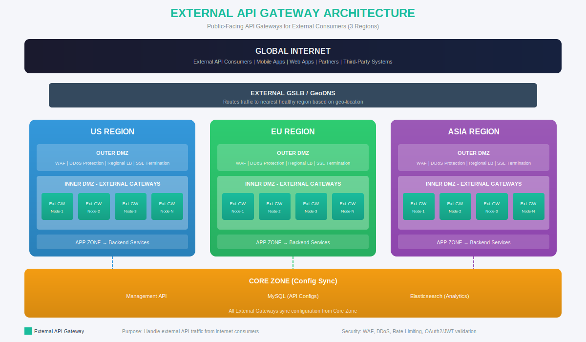
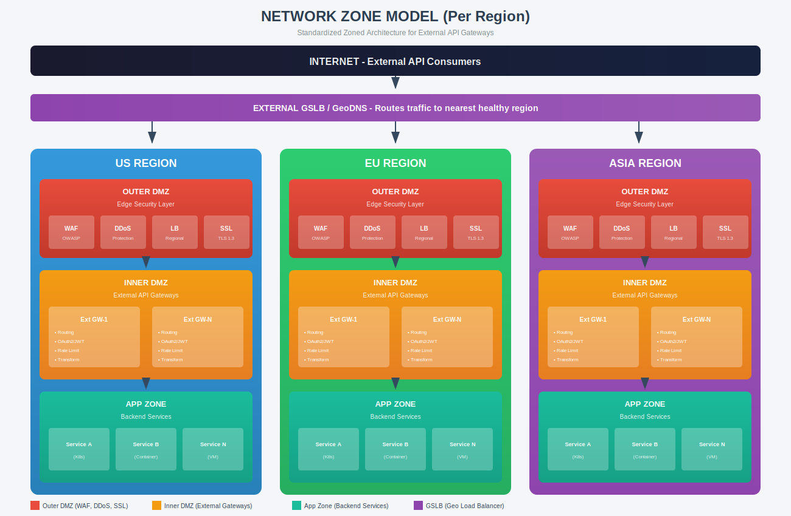

# External API Gateway Architecture

## Overview

This document details the External API Gateway architecture for handling public-facing API traffic from internet consumers across three regions: US, EU, and ASIA.



---

## 1. Purpose

External API Gateways are designed to:
- Handle API requests from internet consumers (mobile apps, web apps, partners, third-party systems)
- Provide geo-distributed low-latency access
- Enforce security policies (authentication, authorization, rate limiting)
- Protect backend services from direct internet exposure

---

## 2. Regional Distribution

| Region | Location | Purpose | Scalability |
|--------|----------|---------|-------------|
| US | North America | Americas traffic | N nodes (auto-scale) |
| EU | Europe | European traffic, GDPR compliance | N nodes (auto-scale) |
| ASIA | Asia-Pacific | APAC traffic | N nodes (auto-scale) |

---

## 3. Network Zone Model (Per Region)


---

## 4. Zone Details

### 4.1 Outer DMZ

| Component | Purpose | Configuration |
|-----------|---------|---------------|
| WAF | Web Application Firewall | OWASP rules, custom rules |
| DDoS Protection | Volumetric attack mitigation | Rate limiting, geo-blocking |
| Regional Load Balancer | Traffic distribution | Round-robin, least connections |
| SSL Termination | TLS/SSL handling | TLS 1.2+, certificate management |

**Security Controls:**
- ✓ Blocks malicious requests
- ✓ Rate limiting (requests/second per IP)
- ✓ Geo-blocking for restricted regions
- ✓ Bot detection and mitigation

### 4.2 Inner DMZ (External Gateways)

| Component | Purpose | Configuration |
|-----------|---------|---------------|
| External API Gateway | API request processing | Gravitee standalone deployment |
| Multiple Nodes | High availability | N nodes, horizontally scalable |

**Gateway Responsibilities:**
- API routing and request transformation
- Authentication (OAuth2, JWT, API Key)
- Authorization and policy enforcement
- Rate limiting per consumer/plan
- Request/response transformation
- Analytics collection

### 4.3 App Zone

| Component | Purpose |
|-----------|---------|
| Backend Services | Actual API implementations |
| Microservices | Business logic |
| Databases | Regional data stores |

---

## 5. External Gateway Configuration

### 5.1 Deployment Model

```yaml
# Per-Region External Gateway Deployment
deployment:
  type: standalone (ZIP)
  nodes: N (auto-scalable)
  mode: active-active
  
resources:
  cpu: 4 cores minimum
  memory: 8GB minimum
  storage: 50GB SSD

network:
  http_port: 8082
  https_port: 8443
  management_port: 18082
```

### 5.2 Configuration Sync

External Gateways sync configuration from Core Zone:

```
Core Zone MySQL ──────► External Gateways
(API Configs)          (All regions sync)

External Gateways ────► Core Zone Elasticsearch
(Analytics data)       (Centralized storage)
```

**Sync Details:**
| Parameter | Value |
|-----------|-------|
| Sync Interval | 5-10 seconds |
| Sync Protocol | HTTPS (TLS 1.2+) |
| Authentication | mTLS / API Key |

---

## 6. Security Architecture

### 6.1 Authentication Methods

| Method | Use Case | Configuration |
|--------|----------|---------------|
| OAuth2 | Partner APIs, B2B | Token introspection / JWT validation |
| JWT | Mobile apps, SPAs | JWKS endpoint validation |
| API Key | Simple integrations | Key validation + rate limiting |
| mTLS | High-security APIs | Client certificate validation |

### 6.2 Rate Limiting

| Tier | Requests/sec | Burst | Quota/day |
|------|--------------|-------|-----------|
| Free | 10 | 20 | 1,000 |
| Basic | 100 | 200 | 100,000 |
| Premium | 1,000 | 2,000 | Unlimited |
| Enterprise | Custom | Custom | Custom |

### 6.3 Security Headers

```
# Required Response Headers
Strict-Transport-Security: max-age=31536000; includeSubDomains
X-Content-Type-Options: nosniff
X-Frame-Options: DENY
X-XSS-Protection: 1; mode=block
Content-Security-Policy: default-src 'self'
```

---

## 7. Firewall Rules

### 7.1 Outer DMZ Inbound

| Source | Destination | Port | Protocol | Action |
|--------|-------------|------|----------|--------|
| Internet | WAF/LB | 443 | HTTPS | ALLOW |
| Internet | WAF/LB | 80 | HTTP | ALLOW (redirect to 443) |
| Any | Any | Any | Any | DENY |

### 7.2 Outer DMZ → Inner DMZ

| Source | Destination | Port | Protocol | Action |
|--------|-------------|------|----------|--------|
| Regional LB | External GW | 8082 | HTTP | ALLOW |
| Regional LB | External GW | 8443 | HTTPS | ALLOW |
| Any | Any | Any | Any | DENY |

### 7.3 Inner DMZ → App Zone

| Source | Destination | Port | Protocol | Action |
|--------|-------------|------|----------|--------|
| External GW | Backend Services | App Ports | HTTPS | ALLOW |
| Any | Any | Any | Any | DENY |

### 7.4 Inner DMZ → Core Zone

| Source | Destination | Port | Protocol | Action |
|--------|-------------|------|----------|--------|
| External GW | Core MySQL | 3306 | TCP | ALLOW |
| External GW | Core Elasticsearch | 9200 | HTTPS | ALLOW |
| External GW | Management API | 8083 | HTTPS | ALLOW |
| Any | Any | Any | Any | DENY |

---

## 8. High Availability

### 8.1 Regional HA

- **Multiple Gateway Nodes**: N nodes per region
- **Active-Active**: All nodes handle traffic
- **Health Checks**: Every 10 seconds
- **Auto-Scaling**: Based on CPU/memory/request rate

### 8.2 Global HA (GSLB)

- **Geo-Routing**: Routes to nearest healthy region
- **Failover**: Automatic failover to next closest region
- **Health Monitoring**: Per-region health endpoints
- **TTL**: DNS TTL of 30-60 seconds for fast failover

---

## 9. Monitoring & Observability

### 9.1 Metrics

| Metric | Description | Alert Threshold |
|--------|-------------|-----------------|
| Request Rate | Requests per second | > 80% capacity |
| Error Rate | 4xx/5xx responses | > 1% of traffic |
| Latency P99 | 99th percentile response time | > 500ms |
| Gateway Health | Node availability | < 2 healthy nodes |

### 9.2 Logging

- Access logs sent to Elasticsearch
- Error logs with full stack traces
- Audit logs for security events
- Log retention: 90 days

---

## 10. Related Documents

| Document | Description |
|----------|-------------|
| [Global Architecture](./GLOBAL-COMPLETE-ARCHITECTURE.md) | Complete global view |
| [Internal Gateway Architecture](./INTERNAL-GATEWAY-ARCHITECTURE.md) | Internal gateway details |
| [Firewall Rules](./FIREWALL_RULES_MULTI_REGION.md) | Complete firewall configurations |

