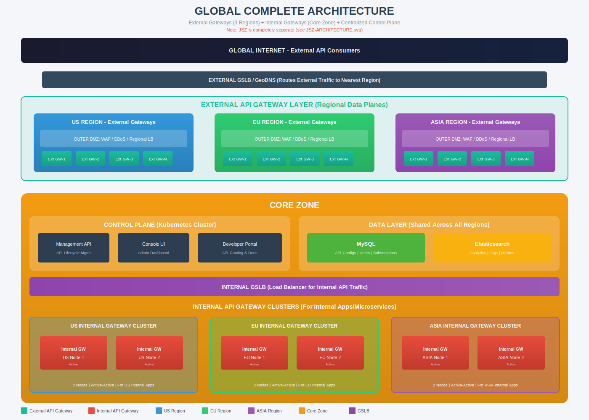

# Global Complete Architecture

## Overview

This document provides a comprehensive view of the entire Gravitee API Management platform architecture, covering all components across multiple regions with centralized control.



---

## 1. Architecture Summary

| Component | Location | Purpose |
|-----------|----------|---------|
| External API Gateways | US, EU, ASIA Regions | Handle external API traffic from internet consumers |
| Internal API Gateways | Core Zone (3 clusters) | Handle internal microservice-to-microservice traffic |
| Control Plane | Core Zone | Centralized API lifecycle management |
| Data Layer | Core Zone | Shared MySQL and Elasticsearch |
| External GSLB | Internet Edge | Routes external traffic to nearest region |
| Internal GSLB | Core Zone | Routes internal traffic to appropriate cluster |

---

## 2. Component Distribution

### 2.1 External Gateway Layer (Regional Data Planes)

| Region | External Gateways | DMZ Zones | Purpose |
|--------|-------------------|-----------|---------|
| US | N nodes (scalable) | Outer DMZ + Inner DMZ | North America traffic |
| EU | N nodes (scalable) | Outer DMZ + Inner DMZ | European traffic |
| ASIA | N nodes (scalable) | Outer DMZ + Inner DMZ | Asia-Pacific traffic |

### 2.2 Internal Gateway Layer (Core Zone)

| Cluster | Nodes | Status | Purpose |
|---------|-------|--------|---------|
| US Internal Cluster | 2 | Active-Active | US internal applications |
| EU Internal Cluster | 2 | Active-Active | EU internal applications |
| ASIA Internal Cluster | 2 | Active-Active | ASIA internal applications |
| **Total** | **6** | - | All internal traffic |

### 2.3 Control Plane (Core Zone)

| Component | Replicas | Purpose |
|-----------|----------|---------|
| Management API | 2+ | API lifecycle management, configuration |
| Console UI | 2+ | Admin dashboard for API management |
| Developer Portal | 2+ | API catalog, documentation, subscriptions |

### 2.4 Data Layer (Core Zone - Shared)

| Component | Purpose | Consumers |
|-----------|---------|-----------|
| MySQL | API configurations, subscriptions, users | All gateways, control plane |
| Elasticsearch | Analytics, logs, metrics | All gateways, dashboards |

---

## 3. Traffic Flow

### 3.1 External Traffic Flow

```
Internet Users
      │
      ▼
┌─────────────────────────────────────────────────────┐
│           EXTERNAL GSLB / GeoDNS                    │
│   (Routes to nearest healthy regional gateway)      │
└─────────────────────────────────────────────────────┘
      │                    │                    │
      ▼                    ▼                    ▼
┌──────────┐        ┌──────────┐        ┌──────────┐
│ US Region│        │ EU Region│        │ASIA Region│
│ Ext GWs  │        │ Ext GWs  │        │ Ext GWs  │
└──────────┘        └──────────┘        └──────────┘
      │                    │                    │
      └────────────────────┼────────────────────┘
                           ▼
                    Backend Services
```

### 3.2 Internal Traffic Flow

```
Internal Applications / Microservices
      │
      ▼
┌─────────────────────────────────────────────────────┐
│              INTERNAL GSLB                          │
│   (Routes to appropriate regional cluster)          │
└─────────────────────────────────────────────────────┘
      │                    │                    │
      ▼                    ▼                    ▼
┌──────────┐        ┌──────────┐        ┌──────────┐
│ US Int   │        │ EU Int   │        │ASIA Int  │
│ Cluster  │        │ Cluster  │        │ Cluster  │
└──────────┘        └──────────┘        └──────────┘
      │                    │                    │
      └────────────────────┼────────────────────┘
                           ▼
                    Backend Microservices
```

### 3.3 Configuration Sync Flow

```
┌─────────────────────────────────────────────────────┐
│                    CORE ZONE                        │
│  ┌─────────────────────────────────────────────┐   │
│  │          Control Plane (K8s)                 │   │
│  │  Management API ──► MySQL (API Configs)     │   │
│  └─────────────────────────────────────────────┘   │
└─────────────────────────────────────────────────────┘
                           │
           ┌───────────────┼───────────────┐
           │               │               │
           ▼               ▼               ▼
    ┌────────────┐  ┌────────────┐  ┌────────────┐
    │ US Region  │  │ EU Region  │  │ASIA Region │
    │ Ext GWs    │  │ Ext GWs    │  │ Ext GWs    │
    │ (sync)     │  │ (sync)     │  │ (sync)     │
    └────────────┘  └────────────┘  └────────────┘
           │               │               │
           ▼               ▼               ▼
    ┌────────────┐  ┌────────────┐  ┌────────────┐
    │ US Int GW  │  │ EU Int GW  │  │ASIA Int GW │
    │ Cluster    │  │ Cluster    │  │ Cluster    │
    │ (sync)     │  │ (sync)     │  │ (sync)     │
    └────────────┘  └────────────┘  └────────────┘
```

---

## 4. High Availability

### 4.1 External Gateways
- Multiple nodes per region (N nodes, scalable)
- Regional load balancer distributes traffic
- External GSLB provides geo-routing and failover
- Health checks every 10 seconds

### 4.2 Internal Gateways
- 2 nodes per regional cluster (Active-Active)
- Internal GSLB routes traffic to healthy nodes
- Automatic failover within cluster
- Cross-cluster failover available

### 4.3 Control Plane
- Kubernetes-based deployment with replicas
- Auto-scaling based on load
- Rolling updates for zero-downtime deployments

### 4.4 Data Layer
- MySQL: Primary-Replica configuration
- Elasticsearch: Multi-node cluster with sharding
- Regular automated backups

---

## 5. Security Layers

| Layer | Components | Security Controls |
|-------|------------|-------------------|
| Edge | External GSLB | DDoS protection, geo-blocking |
| Outer DMZ | WAF, Regional LB | WAF rules, SSL termination, rate limiting |
| Inner DMZ | External Gateways | JWT/OAuth2 validation, API key auth |
| Core Zone | Internal Gateways | mTLS, service mesh, internal auth |
| Data Layer | MySQL, Elasticsearch | Encryption at rest, network isolation |

---

## 6. Related Documents

| Document | Description |
|----------|-------------|
| [External Gateway Architecture](./EXTERNAL-GATEWAY-ARCHITECTURE.md) | Detailed external gateway setup |
| [Internal Gateway Architecture](./INTERNAL-GATEWAY-ARCHITECTURE.md) | Detailed internal gateway setup |
| [JSZ Architecture](./JSZ-ARCHITECTURE.md) | Japan Secure Zone (separate) |
| [Firewall Rules](./FIREWALL_RULES_MULTI_REGION.md) | Complete firewall configurations |

---

## 7. Note on Japan Secure Zone (JSZ)

> ⚠️ **JSZ is completely separate from this global architecture.**
> 
> JSZ operates independently with:
> - NO External Gateway (internal traffic only)
> - Dedicated Internal Gateway cluster
> - One-way sync from Core Zone (JSZ polls config, pushes analytics)
> - Complete network isolation
> 
> See [JSZ Architecture](./JSZ-ARCHITECTURE.md) for details.

