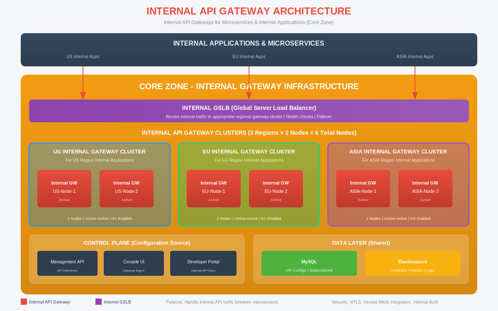

# Internal API Gateway Architecture

## Overview

This document details the Internal API Gateway architecture for handling internal microservice-to-microservice communication. All Internal Gateways are deployed within the Core Zone with regional clusters.



---

## 1. Purpose

Internal API Gateways are designed to:
- Handle API traffic between internal applications and microservices
- Provide centralized governance for internal APIs
- Enable service discovery and routing
- Enforce internal security policies (mTLS, RBAC)
- Collect analytics for internal API usage

---

## 2. Architecture Overview

```
┌─────────────────────────────────────────────────────────────────┐
│                 INTERNAL APPLICATIONS                           │
│     US Apps         EU Apps         ASIA Apps                   │
└─────────────────────────────────────────────────────────────────┘
                              │
                              ▼
┌─────────────────────────────────────────────────────────────────┐
│                    INTERNAL GSLB                                │
│         Routes to appropriate regional cluster                  │
└─────────────────────────────────────────────────────────────────┘
                              │
          ┌───────────────────┼───────────────────┐
          ▼                   ▼                   ▼
┌─────────────────┐  ┌─────────────────┐  ┌─────────────────┐
│  US INTERNAL    │  │  EU INTERNAL    │  │ ASIA INTERNAL   │
│  GW CLUSTER     │  │  GW CLUSTER     │  │  GW CLUSTER     │
│  (2 Nodes)      │  │  (2 Nodes)      │  │  (2 Nodes)      │
└─────────────────┘  └─────────────────┘  └─────────────────┘
          │                   │                   │
          └───────────────────┼───────────────────┘
                              ▼
                    Backend Microservices
```

---

## 3. Cluster Distribution

All Internal Gateway clusters reside in the **Core Zone**:

| Cluster | Nodes | Status | Purpose |
|---------|-------|--------|---------|
| US Internal Cluster | 2 | Active-Active | US region internal applications |
| EU Internal Cluster | 2 | Active-Active | EU region internal applications |
| ASIA Internal Cluster | 2 | Active-Active | ASIA region internal applications |
| **Total Nodes** | **6** | - | All internal traffic |

---

## 4. Internal GSLB

The Internal Global Server Load Balancer provides:

| Feature | Description |
|---------|-------------|
| Traffic Routing | Routes internal requests to appropriate regional cluster |
| Health Checks | Monitors all gateway nodes |
| Failover | Automatic failover to healthy nodes/clusters |
| Load Balancing | Distributes traffic evenly across nodes |

### Routing Logic

```
IF source_region == "US" THEN
    route_to: US Internal Cluster
ELSE IF source_region == "EU" THEN
    route_to: EU Internal Cluster
ELSE IF source_region == "ASIA" THEN
    route_to: ASIA Internal Cluster
ELSE
    route_to: nearest healthy cluster
```

---

## 5. Cluster Details

### 5.1 US Internal Gateway Cluster

```
┌─────────────────────────────────────────────────────────────┐
│               US INTERNAL GATEWAY CLUSTER                    │
│                   (Core Zone)                                │
├─────────────────────────────────────────────────────────────┤
│                                                              │
│   ┌─────────────────────┐    ┌─────────────────────┐       │
│   │   Internal GW       │    │   Internal GW       │       │
│   │   US-Node-1         │    │   US-Node-2         │       │
│   │   (Active)          │    │   (Active)          │       │
│   │                     │    │                     │       │
│   │   • Port: 8082      │    │   • Port: 8082      │       │
│   │   • mTLS enabled    │    │   • mTLS enabled    │       │
│   │   • Health: /health │    │   • Health: /health │       │
│   └─────────────────────┘    └─────────────────────┘       │
│                                                              │
│   Purpose: US region internal applications                  │
│   HA Mode: Active-Active                                    │
└─────────────────────────────────────────────────────────────┘
```

### 5.2 EU Internal Gateway Cluster

```
┌─────────────────────────────────────────────────────────────┐
│               EU INTERNAL GATEWAY CLUSTER                    │
│                   (Core Zone)                                │
├─────────────────────────────────────────────────────────────┤
│                                                              │
│   ┌─────────────────────┐    ┌─────────────────────┐       │
│   │   Internal GW       │    │   Internal GW       │       │
│   │   EU-Node-1         │    │   EU-Node-2         │       │
│   │   (Active)          │    │   (Active)          │       │
│   │                     │    │                     │       │
│   │   • Port: 8082      │    │   • Port: 8082      │       │
│   │   • mTLS enabled    │    │   • mTLS enabled    │       │
│   │   • Health: /health │    │   • Health: /health │       │
│   └─────────────────────┘    └─────────────────────┘       │
│                                                              │
│   Purpose: EU region internal applications                  │
│   HA Mode: Active-Active                                    │
└─────────────────────────────────────────────────────────────┘
```

### 5.3 ASIA Internal Gateway Cluster

```
┌─────────────────────────────────────────────────────────────┐
│              ASIA INTERNAL GATEWAY CLUSTER                   │
│                   (Core Zone)                                │
├─────────────────────────────────────────────────────────────┤
│                                                              │
│   ┌─────────────────────┐    ┌─────────────────────┐       │
│   │   Internal GW       │    │   Internal GW       │       │
│   │   ASIA-Node-1       │    │   ASIA-Node-2       │       │
│   │   (Active)          │    │   (Active)          │       │
│   │                     │    │                     │       │
│   │   • Port: 8082      │    │   • Port: 8082      │       │
│   │   • mTLS enabled    │    │   • mTLS enabled    │       │
│   │   • Health: /health │    │   • Health: /health │       │
│   └─────────────────────┘    └─────────────────────┘       │
│                                                              │
│   Purpose: ASIA region internal applications                │
│   HA Mode: Active-Active                                    │
└─────────────────────────────────────────────────────────────┘
```

---

## 6. Internal Gateway Configuration

### 6.1 Deployment Model

```yaml
# Internal Gateway Deployment Configuration
deployment:
  type: standalone (ZIP) or Kubernetes
  nodes_per_cluster: 2
  mode: active-active
  location: Core Zone
  
resources:
  cpu: 2 cores minimum
  memory: 4GB minimum
  storage: 30GB SSD

network:
  http_port: 8082
  management_port: 18082
  mtls: enabled
```

### 6.2 Configuration Sync

Internal Gateways sync from the same Core Zone data layer:

```
┌─────────────────────────────────────────────────────────────┐
│                      CORE ZONE                               │
│                                                              │
│  ┌─────────────────┐    ┌─────────────────┐                │
│  │     MySQL       │    │  Elasticsearch  │                │
│  │  (API Configs)  │    │   (Analytics)   │                │
│  └────────┬────────┘    └────────▲────────┘                │
│           │                      │                          │
│           ▼                      │                          │
│  ┌────────────────────────────────────────────────────┐    │
│  │              Internal Gateway Clusters              │    │
│  │  US Cluster ◄──── sync ────► EU Cluster            │    │
│  │       ▲                           ▲                 │    │
│  │       └──────── sync ─────────────┘                │    │
│  │                    │                                │    │
│  │               ASIA Cluster                          │    │
│  └────────────────────────────────────────────────────┘    │
└─────────────────────────────────────────────────────────────┘
```

---

## 7. Security Architecture

### 7.1 Authentication Methods

| Method | Use Case | Description |
|--------|----------|-------------|
| mTLS | Service-to-service | Mutual TLS with client certificates |
| JWT | Internal apps | Service account tokens |
| Internal API Key | Simple integrations | Pre-shared keys |

### 7.2 mTLS Configuration

```yaml
# mTLS Configuration for Internal Gateways
ssl:
  enabled: true
  client_auth: required
  
  keystore:
    type: PKCS12
    path: /path/to/keystore.p12
    password: ${KEYSTORE_PASSWORD}
    
  truststore:
    type: PKCS12
    path: /path/to/truststore.p12
    password: ${TRUSTSTORE_PASSWORD}
```

### 7.3 RBAC (Role-Based Access Control)

| Role | Permissions |
|------|-------------|
| service-reader | Read APIs, invoke GET endpoints |
| service-writer | Read/Write APIs, invoke all endpoints |
| service-admin | Full access, manage subscriptions |

---

## 8. Use Cases

### 8.1 Microservice Communication

```
┌───────────────┐     ┌───────────────┐     ┌───────────────┐
│   Order       │     │   Internal    │     │   Inventory   │
│   Service     │────►│   Gateway     │────►│   Service     │
└───────────────┘     └───────────────┘     └───────────────┘
                              │
                              ▼
                      ┌───────────────┐
                      │   Analytics   │
                      │   (logged)    │
                      └───────────────┘
```

### 8.2 Service Discovery

Internal Gateways provide a single endpoint for service discovery:

```
# Internal API URL Pattern
https://internal-api.corp.local/{service-name}/{endpoint}

# Examples
https://internal-api.corp.local/inventory/v1/products
https://internal-api.corp.local/orders/v1/orders/123
https://internal-api.corp.local/users/v1/profile
```

### 8.3 Cross-Region Internal Calls

```
US Internal App ──► US Internal GW ──► EU Backend Service
                         │
                         └──► (via Internal GSLB routing)
```

---

## 9. Firewall Rules

### 9.1 Inbound to Internal Gateways

| Source | Destination | Port | Protocol | Action |
|--------|-------------|------|----------|--------|
| Internal Apps | Internal GSLB | 443 | HTTPS | ALLOW |
| Internal GSLB | Internal GW Nodes | 8082 | HTTP/mTLS | ALLOW |
| Any | Any | Any | Any | DENY |

### 9.2 Outbound from Internal Gateways

| Source | Destination | Port | Protocol | Action |
|--------|-------------|------|----------|--------|
| Internal GW | Backend Microservices | App Ports | HTTPS | ALLOW |
| Internal GW | MySQL (Core Zone) | 3306 | TCP | ALLOW |
| Internal GW | Elasticsearch (Core Zone) | 9200 | HTTPS | ALLOW |
| Any | Any | Any | Any | DENY |

---

## 10. High Availability

### 10.1 Cluster HA

- **2 Nodes per Cluster**: Active-Active configuration
- **Health Checks**: Every 5 seconds
- **Automatic Failover**: Within cluster
- **Zero Downtime**: Rolling updates supported

### 10.2 Cross-Cluster Failover

If an entire cluster becomes unavailable:
1. Internal GSLB detects cluster health failure
2. Traffic automatically routed to nearest healthy cluster
3. Alert triggered for operations team

---

## 11. Monitoring

### 11.1 Key Metrics

| Metric | Description | Alert Threshold |
|--------|-------------|-----------------|
| Internal Request Rate | Requests per second | > 90% capacity |
| Inter-service Latency | P99 response time | > 100ms |
| mTLS Handshake Failures | Certificate issues | > 0.1% |
| Cluster Health | Nodes available | < 2 healthy |

### 11.2 Dashboards

- Internal API usage by service
- Cross-region traffic patterns
- Error rates and latency trends
- Service dependency mapping

---

## 12. Related Documents

| Document | Description |
|----------|-------------|
| [Global Architecture](./GLOBAL-COMPLETE-ARCHITECTURE.md) | Complete global view |
| [External Gateway Architecture](./EXTERNAL-GATEWAY-ARCHITECTURE.md) | External gateway details |
| [JSZ Architecture](./JSZ-ARCHITECTURE.md) | Japan Secure Zone (separate) |
| [Firewall Rules](./FIREWALL_RULES_MULTI_REGION.md) | Complete firewall configurations |

