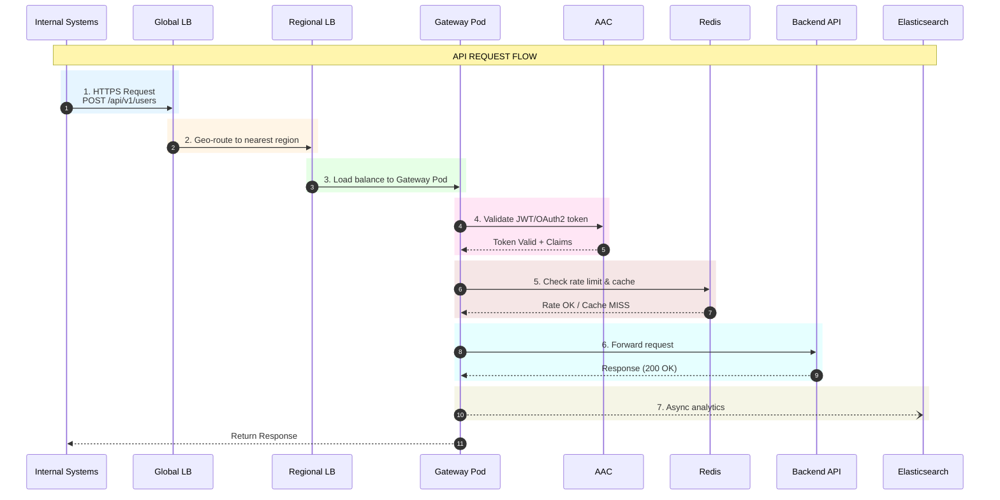
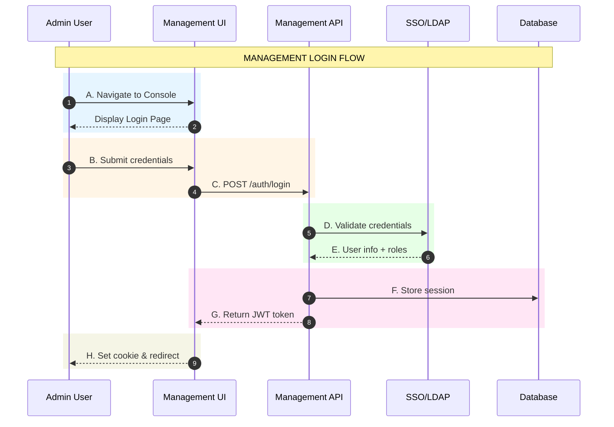
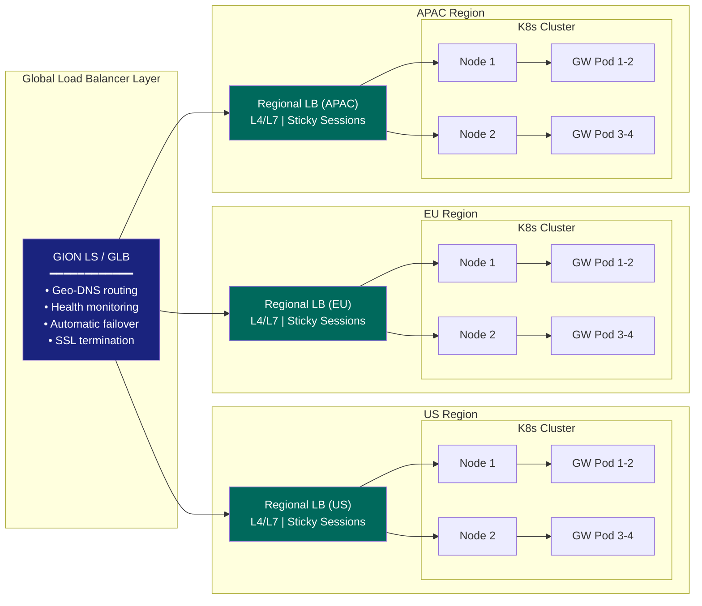
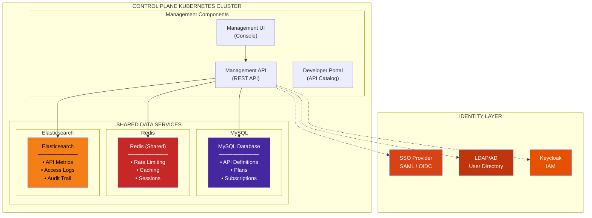
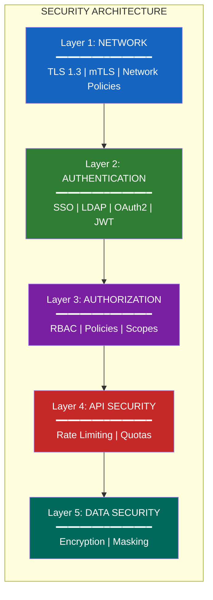
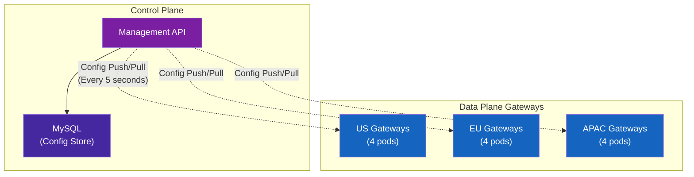

# Core Zone - HLD Architecture (Mermaid Diagrams)

## 1. Architecture Overview

```mermaid
flowchart TB
    %% ==================== STYLING ====================
    classDef internalSys fill:#455a64,stroke:#263238,color:#fff,stroke-width:2px
    classDef globalLB fill:#1a237e,stroke:#0d47a1,color:#fff,stroke-width:2px
    classDef regionalLB fill:#00695c,stroke:#004d40,color:#fff,stroke-width:2px
    classDef k8sCluster fill:#0277bd,stroke:#01579b,color:#fff,stroke-width:2px
    classDef gateway fill:#1565c0,stroke:#0d47a1,color:#fff,stroke-width:2px
    classDef controlPlane fill:#6a1b9a,stroke:#4a148c,color:#fff,stroke-width:2px
    classDef mgmtComp fill:#9c27b0,stroke:#7b1fa2,color:#fff,stroke-width:2px
    classDef redis fill:#c62828,stroke:#b71c1c,color:#fff,stroke-width:2px
    classDef elasticsearch fill:#f57f17,stroke:#e65100,color:#000,stroke-width:2px
    classDef mysql fill:#4527a0,stroke:#311b92,color:#fff,stroke-width:2px
    classDef identity fill:#d84315,stroke:#bf360c,color:#fff,stroke-width:2px
    classDef aac fill:#00838f,stroke:#006064,color:#fff,stroke-width:2px
    classDef backend fill:#37474f,stroke:#263238,color:#fff,stroke-width:2px

    %% ==================== DATA PLANE ====================
    subgraph DataPlane["DATA PLANE - Internal API Gateway"]
        direction TB
        
        InternalSys["Internal Systems<br/>(Microservices, Apps)"]:::internalSys
        
        GLB["Global Load Balancer<br/>(GION LS / GLB)<br/>Geo-routing | Health Checks"]:::globalLB
        
        subgraph US["US REGION"]
            direction TB
            US_RLB["Regional LB<br/>(US)"]:::regionalLB
            subgraph US_K8S["Kubernetes Cluster (US)"]
                US_Node1["Worker Node 1<br/>Gravitee Gateway<br/>Replicas: 2"]:::gateway
                US_Node2["Worker Node 2<br/>Gravitee Gateway<br/>Replicas: 2"]:::gateway
            end
        end
        
        subgraph EU["EU REGION"]
            direction TB
            EU_RLB["Regional LB<br/>(EU)"]:::regionalLB
            subgraph EU_K8S["Kubernetes Cluster (EU)"]
                EU_Node1["Worker Node 1<br/>Gravitee Gateway<br/>Replicas: 2"]:::gateway
                EU_Node2["Worker Node 2<br/>Gravitee Gateway<br/>Replicas: 2"]:::gateway
            end
        end
        
        subgraph APAC["APAC REGION"]
            direction TB
            APAC_RLB["Regional LB<br/>(APAC)"]:::regionalLB
            subgraph APAC_K8S["Kubernetes Cluster (APAC)"]
                APAC_Node1["Worker Node 1<br/>Gravitee Gateway<br/>Replicas: 2"]:::gateway
                APAC_Node2["Worker Node 2<br/>Gravitee Gateway<br/>Replicas: 2"]:::gateway
            end
        end
        
        AAC["Gravitee AAC<br/>Access & Authorization<br/>Token Validation | OAuth2"]:::aac
        
        Backend["Internal API Backends<br/>Microservices | Legacy | Databases"]:::backend
    end

    %% ==================== CONTROL PLANE ====================
    subgraph ControlPlane["CONTROL PLANE (Shared)"]
        direction TB
        
        subgraph MgmtK8s["Kubernetes Cluster - Management"]
            MgmtUI["Management UI<br/>(Console)"]:::mgmtComp
            MgmtAPI["Management API<br/>(REST)"]:::mgmtComp
            DevPortal["Developer Portal<br/>(Catalog)"]:::mgmtComp
        end
        
        subgraph DataServices["Shared Data Services"]
            MySQL["MySQL Database<br/>API Definitions<br/>Plans & Subscriptions"]:::mysql
            Redis["Redis (Shared)<br/>Rate Limiting<br/>Distributed Cache"]:::redis
            ES["Elasticsearch<br/>Analytics & Metrics<br/>Access Logs"]:::elasticsearch
        end
    end

    %% ==================== IDENTITY LAYER ====================
    subgraph IdentityLayer["IDENTITY LAYER"]
        direction LR
        SSO["SSO Provider<br/>(SAML/OIDC)"]:::identity
        LDAP["LDAP/AD<br/>(User Dir)"]:::identity
        Keycloak["Keycloak<br/>(IAM)"]:::identity
    end

    %% ==================== TRAFFIC FLOW CONNECTIONS ====================
    InternalSys -->|"1. API Request"| GLB
    GLB -->|"2. Geo-routing"| US_RLB
    GLB -->|"2. Geo-routing"| EU_RLB
    GLB -->|"2. Geo-routing"| APAC_RLB
    
    US_RLB -->|"3"| US_Node1
    US_RLB -->|"3"| US_Node2
    EU_RLB -->|"3"| EU_Node1
    EU_RLB -->|"3"| EU_Node2
    APAC_RLB -->|"3"| APAC_Node1
    APAC_RLB -->|"3"| APAC_Node2
    
    US_Node1 -.->|"4. Token"| AAC
    US_Node1 -.->|"5. Rate/Cache"| Redis
    US_Node1 -->|"6. API Call"| Backend
    US_Node1 -.->|"7. Analytics"| ES
    
    MgmtAPI -.->|"Config Sync"| US_Node1
    MgmtUI --> MgmtAPI
    MgmtAPI --> MySQL
    MgmtAPI -.-> SSO
```

---

## 2. API Traffic Flow (Sequence)

---

## 3. Management Login Flow

---

## 4. Data Plane - Regional Architecture

---

## 5. Control Plane Architecture

---

## 6. Security Layers

---

## 7. Configuration Sync Flow

---

## Legend

| Symbol | Meaning |
|--------|---------|
| `-->` | Synchronous request/response |
| `-.->` | Async/optional connection |
| `--)` | Fire-and-forget (async) |
| Numbered circles (1-7) | API Traffic Flow steps |
| Lettered circles (A-H) | Login Flow steps |

---

## Flow Summary

### API Traffic Flow Steps
| Step | From | To | Action |
|------|------|----|--------|
| **1** | Internal Systems | Global LB | Initial request |
| **2** | Global LB | Regional LB | Geo-routing |
| **3** | Regional LB | K8s Gateway | Load balancing |
| **4** | Gateway | AAC | Token validation |
| **5** | Gateway | Redis | Rate limit + cache |
| **6** | Gateway | Backend | API invocation |
| **7** | Gateway | Elasticsearch | Analytics (async) |

### Login Flow Steps
| Step | From | To | Action |
|------|------|----|--------|
| **A** | User | UI | Navigate to console |
| **B** | User | UI | Submit credentials |
| **C** | UI | API | Forward auth request |
| **D** | API | SSO/LDAP | Validate credentials |
| **E** | SSO/LDAP | API | Return user info |
| **F** | API | Database | Store session |
| **G** | API | UI | Return JWT token |
| **H** | UI | User | Set cookie & redirect |
